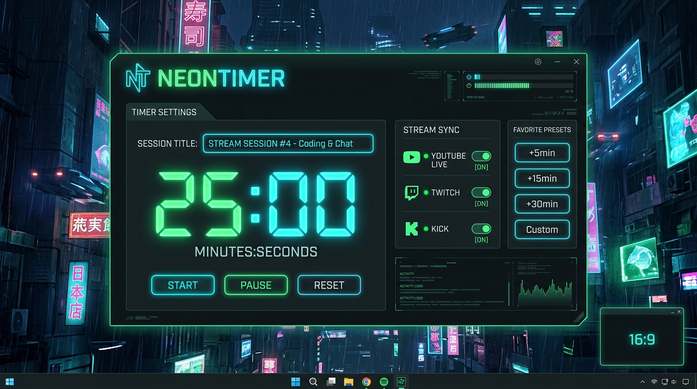
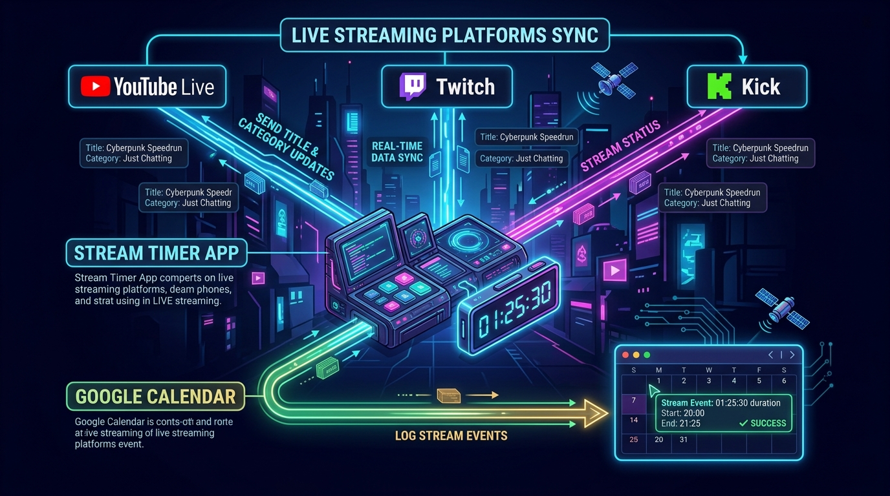

# NeonTimer Compact ⏱️🎮



**NeonTimer Compact** は、ライブ配信者（ストリーマー）向けに開発された、超軽量・コンパクトな**デスクトップタイマー＆配信情報一括同期ツール**です。

ネオン調のサイバーパンクなデザインで画面端に常時表示でき、タイマーの進行に合わせて **YouTube Live / Twitch / Kick の配信タイトルやカテゴリを一括自動更新**し、配信記録を **Google カレンダーへ自動同期**します。

---

## 🌟 主な特徴



1. **サイバーネオン UI & デスクトップ常時最前面表示**
   - 透過背景＆ネオン発光デザイン。邪魔にならないコンパクトサイズで常に最前面に表示されます。
   - ウィンドウを掴んで自由にドラッグ移動可能。終了時の位置・サイズ・フォント設定を自動記憶します。
2. **配信プラットフォームへの一括タイトル・カテゴリ即時反映**
   - 題名やお気に入りカテゴリを選択した瞬間に、**YouTube Live・Twitch・Kick** の配信枠情報が即座に自動更新されます。
3. **Google カレンダー自動同期 & 連続イベント結合**
   - タイマー開始〜終了（またはカウントアップ）の作業・配信時間を Google カレンダーに自動で記録。
   - 10分以内の短いインターバルで同じ題名のタイマーを連続実行した場合、1つのカレンダー予定として自動的に結合・マージされます。
4. **お気に入り管理機能（最大50件）**
   - よく使う配信タイトルやお気に入りカテゴリをそれぞれ最大50件まで保存可能。
   - 選択するだけで瞬時にAPI送信＆タイトル反映が完了します。
5. **事前ログイン検証機能**
   - アプリ起動時およびタイマー開始時に Google/Twitch の認証トークン有効性を自動チェック。長時間配信で期限切れになっても自動で再認証が促されます。

---

## 🖥️ UI操作ガイド

```text
┌─────────────────────────────────────────────────────────────┐
│ [ 題名入力エリア (自動リサイズ・改行対応)               ] │
├─────────────────────────────────────────────────────────────┤
│                                                             │
│                      25:00                                  │
│             (クリックで スタート / 一時停止)                │
│                                                             │
│ ─────────────────────────────────────────────────────────── │
│ [ 進行度プログレスバー (残り時間に合わせて伸縮)           ] │
├─────────────────────────────────────────────────────────────┤
│ [🏷️📂] [🏷️★]  [🎮 Twitchカテゴリ入力]  [🎮📂] [🎮★] [🔤] [⏱️]│
├─────────────────────────────────────────────────────────────┤
│ [ 5m ] [ 15m ] [ 30m ] [ 1h ] [ 1h ] [ 1h ] (プリセット時間)│
└─────────────────────────────────────────────────────────────┘
```

| アイコン / ボタン | 機能説明 |
| :--- | :--- |
| **中央のタイマー数字** | クリックで **タイマー開始 / 一時停止** を切り替えます。 |
| **🏷️📂 (題名一覧)** | 保存したお気に入り題名リストを開き、クリックで即座に入力＆API反映します。 |
| **🏷️★ (題名保存)** | 現在入力されている題名をお気に入りリストに保存（または削除）します。 |
| **🎮 Twitchカテゴリ** | カテゴリ名を入力（Twitch APIによる自動補完候補つき）。 |
| **🎮📂 (カテゴリ一覧)**| 保存したお気に入りカテゴリ一覧を開き、クリックで即座に配信へ反映します。 |
| **🎮★ (カテゴリ保存)**| 現在入力されているカテゴリをお気に入りリストに保存（または削除）します。 |
| **🔤 (フォント設定)** | 題名サイズ、タイマーサイズ、字送り、全体スケール、フォント種類を調整できます。 |
| **⏱️ / ⏳ (モード切替)**| カウントダウンモードとカウントアップ（経過時間計測）モードを切り替えます。 |
| **下部プリセット枠** | クリックでその時間をタイマーに設定。枠内の「▲ / ▼」でプリセット時間をカスタマイズ可能。 |

---

## 🚀 導入・起動方法

### 方式A：ビルド済み実行ファイルから起動（推奨）

1. [GitHub Releases (v1.0.0)](https://github.com/orangeqoon/NeonTimerApp/releases/tag/v1.0.0) から **`NeonTimer-win32-x64.zip`** をダウンロードして解凍します。
2. 解凍したフォルダ内の **`NeonTimer.exe`** をダブルクリックして起動します。
3. 初回起動時にタスクバーや画面端にネオンタイマーが表示されます。

### 方式B：ソースコードから開発・起動

Node.js (v18以上推奨) がインストールされている環境で以下を実行します：

```bash
# 依存パッケージのインストール
npm install

# 開発モードでアプリ起動
npm start
```

---

## ⚙️ 各プラットフォームの API 連携設定

初回のみ、各配信サービスおよび Google の API 認証情報を設定します。
（※設定ファイルはリポジトリのルートフォルダ `c:\scripts\NeonTimerApp` 直下に配置します）

### 1. Google カレンダー & YouTube Live 連携 (`credentials.json`)
1. [Google Cloud Console](https://console.cloud.google.com/) でプロジェクトを作成し、**Google Calendar API** および **YouTube Data API v3** を有効化します。
2. 「OAuth 2.0 クライアント ID」（デスクトップアプリ）を作成し、認証情報 JSON をダウンロードします。
3. ファイル名を **`credentials.json`** に変更して本アプリのフォルダ直下に配置します。
4. 初回タイマー起動時にブラウザが開き、Google アカウントへのアクセス許可を求められますので承認してください。

### 2. Twitch 連携 (`twitch-config.json`)
[Twitch Developer Console](https://dev.twitch.tv/console/apps) でアプリケーションを作成し、以下のフォーマットで **`twitch-config.json`** を作成します：

```json
{
  "client_id": "あなたのTwitch_CLIENT_ID",
  "client_secret": "あなたのTwitch_CLIENT_SECRET"
}
```

初回または再認証時は、以下のコマンドでトークンを取得できます：
```bash
node get-twitch-token.js
```

### 3. Kick 連携 (`kick-config.json`)
[Kick Developer Dashboard](https://kick.com/dashboard/developer) でアプリケーションを作成し、以下のフォーマットで **`kick-config.json`** を作成します：

```json
{
  "client_id": "あなたのKick_CLIENT_ID",
  "client_secret": "あなたのKick_CLIENT_SECRET",
  "redirect_uri": "http://localhost:3000/oauth2callback"
}
```

---

## 📦 アプリのビルド方法 (exeの再生成)

コードを変更したり設定を更新した後、以下のコマンドで Windows 向け exe パッケージを生成できます：

```bash
npm run build
```

`NeonTimer-win32-x64` フォルダ内に新しい `NeonTimer.exe` が出力されます。

---

## 🔒 セキュリティとプライバシー

- 各種 API キー、OAuth アクセストークン（`token.json`, `*-config.json`）はすべてローカル環境にのみ保存され、外部サーバーへ勝手に送信されることはありません。
- `.gitignore` により、個人の認証情報やトークンファイルが Git リポジトリへ誤ってコミットされないよう保護されています。

---

## 📄 ライセンス

MIT License
